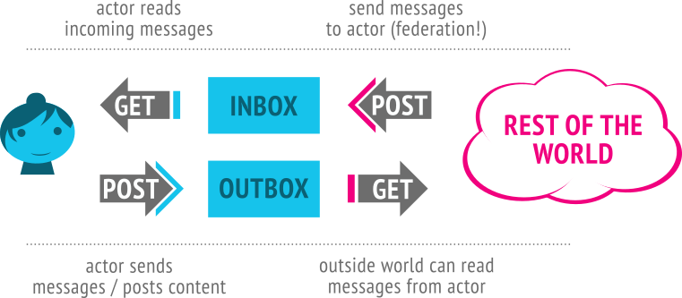

> [!info] 前言
> 前幾天一個朋友看到我登入了 Mastodon，就好奇的問我這是什麼。於是我就解釋了一下，講到後面才發現，有些地方我自己也沒有弄明白，於是有了這篇文章。

## Table of contents

## 聯邦宇宙（Fediverse）介紹

講到聯邦宇宙（Fediverse），最簡單的理解，就是由許多獨立站點共同組成的一個網路，而不是由一家公司經營的平台。

所謂的中心化，舉例來說，就是我們使用的 Instagram 或是 Facebook 這一類的網站，都是所謂的中心化架構。所有的資料都在同一個平台上，然後我們必須遵守平台的規矩。如果平台修改規則、封鎖你的帳號，甚至整個服務停止營運，那你可能就只能退出或是被退出了。

去中心化的差別就是，例如我們都喜歡使用 Mastodon，但是我可以選擇不同的 instance 去加入，instance 相當於是不同的站點，每個站點都有自己的管理方式與站規。有些站點只討論攝影，有些專注於開源軟體，也有些允許較寬鬆的言論環境。我們可以根據自己的需求去加入。或甚至有能力的話，完全可以架設一個屬於自己的站點，然後還是可以跟其他人做互動，這就是聯邦宇宙的魅力。

## 去中心化不等於匿名與安全

不過這邊有一個誤區，很多人以為去中心化等同於匿名或是安全之類的，這完全是一個誤解。

以比較知名的 Mastodon 舉例，如果你使用的是別人經營的站點，那就代表你仍然需要信任那位站長。如果你不認識站長，或是對方只是靠興趣在維護，技術能力跟資源也有限，那麼我們放在上面的資料就可能有風險。因為我們不知道他怎麼備份、怎麼維護，也不知道遇到問題時能不能把資料救回來。

去中心化解決的是「整個網路不會只依賴同一家公司」，不代表個別站點或帳號不會出事。所以如果某一個站點壞掉，其他站點還是可以繼續運作的，但是那個站點上面的使用者就會收到影響。

## 聯邦網路的隱私限制

另一個是隱私的問題，去中心化主要解決的是平台控制權，而不是隱私。而且反過來說，隱私問題變得更加複雜。信任邊界會從一個平台，擴展到原本的站點以及所有的收件站點，還有收件者。

因為貼文會被同步到其他不同的站點上面，然後完全沒辦法知道其他站點的備份方式是什麼。即便在自己的站點上面刪除了一些內容，但沒辦法影響到其他的站點怎麼做。雖然說 ActivityPub 會發送一個 Delete activity，但 ActivityPub 無法強制遠端站點真的移除資料。甚至極端一點，有的站點根本沒處理刪除的行為，那麼自己當初的黑歷史可能就會一直存在聯邦宇宙上面了。

畢竟每個人都可以搭建屬於自己的站點，後面很有可能根本沒有完整的工程團隊，也不一定有穩定的維護資源。這種情況下，使用者也只能自己判斷要不要信任這個站點了。

簡單來說，聯邦宇宙主要處理的是平台控制權與跨站互通問題，所以不能把「去中心化」、「匿名」、「隱私」和「安全」混在一起。選擇一個穩定更新、規則透明，而且可以信任的站點，還是比較實際的做法。

## ActivityPub

再來要說的是，不同的站點到底是怎麼溝通的，這就要講到 ActivityPub。

所謂的聯邦宇宙有非常多的種類，例如發布短文的 Mastodon、也有記錄書籍與影音作品的 NeoDB，以及撰寫長篇文章的 WriteFreely。它們的介面、資料結構與使用方式差異很大，但仍可透過 ActivityPub 交換追蹤、貼文、按讚及轉發等社群活動。

ActivityPub 想解決的問題其實很直接：

不同軟體、不同管理者及不同伺服器，要怎麼在沒有中央平台的情況下交換社群資料。

ActivityPub 是一套建立在 HTTP 與 ActivityStreams 2.0 之上的社群網路協議，包含 client-to-server 與 server-to-server 兩個部分。伺服器之間會用 HTTP 傳送符合 ActivityStreams 格式的 JSON-LD，然後按照共同規則處理裡面的 Follow、Create、Like 等活動。

## WebFinger：從帳號找到 Actor

在傳送 ActivityPub 活動以前，站點還要先知道遠端使用者的 Actor 在哪裡。我們平常看到的 `@hanji@hanji.example` 是方便人閱讀的帳號，但它本身不是 Actor 的網址，因此需要透過 WebFinger 查詢。

WebFinger 不是 ActivityPub 的一部分，而是一套獨立的資源探索協議。站點會把帳號轉成 `acct:` URI，然後向帳號所屬網域的 `/.well-known/webfinger` 發出請求：

```http
GET https://hanji.example/.well-known/webfinger?resource=acct:hanji@hanji.example
```

回應會是一份 JSON Resource Descriptor（JRD），其中的 `self` 連結會指出 Actor 的網址：

```json
{
  "subject": "acct:hanji@hanji.example",
  "links": [
    {
      "rel": "self",
      "type": "application/activity+json",
      "href": "https://hanji.example/users/hanji"
    }
  ]
}
```

找到 Actor 網址後，站點就能取得 Actor 的 JSON-LD 資料，並從裡面找到 `inbox`、`outbox` 等端點。簡單來說，WebFinger 負責「找到這個人」，Actor 文件則告訴其他站點「要怎麼跟這個人互動」。

## Inbox 與 Outbox

大概如下圖，圖片取自 [W3C ActivityPub 規範](https://www.w3.org/TR/activitypub/#overview)。



外部世界把資料送到 actor 的 inbox 
actor 把資料放到 outbox 給外部世界

inbox 負責接收，outbox 負責發布。

圖片是一個簡略的說明，通常放到 outbox 也不是傻傻的等人來看，通常會主動送到別的站點的 inbox。

## 跨站追蹤與發文流程

舉例來說，例如有一個 Hanji 想要追蹤 DBB：

```txt
# 流程
- Hanji 建立 Follow 活動 
- 放到 Hanji 的 Outbox
- POST Follow 到 DBB 的 Inbox 
- DBB 的伺服器假設直接接受 
- POST Accept 到 Hanji 的 Inbox
```

實際內容可能是

```json
{
  "@context": "https://www.w3.org/ns/activitystreams",
  "type": "Follow",
  "actor": "https://hanji.example/users/hanji",
  "object": "https://dbb.example/users/dbb"
}
```

```json
{
  "@context": "https://www.w3.org/ns/activitystreams",
  "type": "Accept",
  "actor": "https://dbb.example/users/dbb",
  "object": {
    "type": "Follow",
    "actor": "https://hanji.example/users/hanji",
    "object": "https://dbb.example/users/dbb"
  }
}
```


發文的話則是

```txt
# 流程
- Hanji 建立貼文 
- 產生 Create 活動並放入 Hanji 的 Outbox 
- Hanji 的伺服器解析 to、cc 或是 followers 等收件者 
- 將活動配送至遠端伺服器的 Inbox 
- 遠端伺服器將貼文顯示給當地的追蹤者
```

```json
{
  "@context": "https://www.w3.org/ns/activitystreams",
  "type": "Create",
  "actor": "https://hanji.example/users/hanji",
  "object": {
    "type": "Note",
    "content": "今天發布了一篇新文章。"
  },
  "to": [
    "https://www.w3.org/ns/activitystreams#Public"
  ],
  "cc": [
    "https://hanji.example/users/hanji/followers"
  ]
}

```

## 結語

簡單的互動就是這樣，實際上要實作一個完整的聯邦宇宙實例還是挺有難度的，不是發送幾個 JSON 這麼簡單。不過如果只是要做一個可以被聯邦宇宙查詢到的小玩具，倒是沒有想像中困難。

我用 Python 和 Flask 寫了一個很小的專案，只做最基本的 WebFinger、Actor 和 Inbox，再搭配 ngrok 讓外面的站點可以連進來。它不是一個完整的 ActivityPub 服務，不過已經可以拿來體驗 Fediverse 是怎麼找到一個遠端身分的。

也算是簡單感受一下聯邦宇宙的魅力：每個人都可以建立自己的身分，加入這個宇宙。

程式放在 GitHub，有興趣的話可以自己下載來玩。連結如下

https://github.com/crzbread/FediPin

## 參考資料

- [ActivityPub — W3C Recommendation](https://www.w3.org/TR/activitypub/)：ActivityPub 的完整規範，包含 Actor、inbox、outbox、活動傳遞，以及 client-to-server 和 server-to-server 流程。
- [ActivityStreams 2.0 — W3C Recommendation](https://www.w3.org/TR/activitystreams-core/)：ActivityPub 使用的資料格式，以及 JSON-LD 文件的基本結構。
- [Activity Vocabulary — W3C Recommendation](https://www.w3.org/TR/activitystreams-vocabulary/)：`Follow`、`Accept`、`Create`、`Delete`、`Like` 等活動與物件類型的定義。
- [RFC 7033 — WebFinger](https://www.rfc-editor.org/rfc/rfc7033)：WebFinger 的正式規範，說明如何透過 `/.well-known/webfinger` 查詢網路資源。
- [ActivityPub and WebFinger — W3C Social Web Incubator Community Group](https://www.w3.org/community/reports/socialcg/CG-FINAL-apwf-20240608/)：說明 Fediverse 如何使用 WebFinger，從帳號找到 ActivityPub Actor。
- [ActivityPub — Mastodon documentation](https://docs.joinmastodon.org/spec/activitypub/)：Mastodon 實際支援的 ActivityPub 屬性、活動及聯邦行為。
- [NeoDB](https://neodb.social/about/)：NeoDB 的服務介紹與 Fediverse 整合說明。

