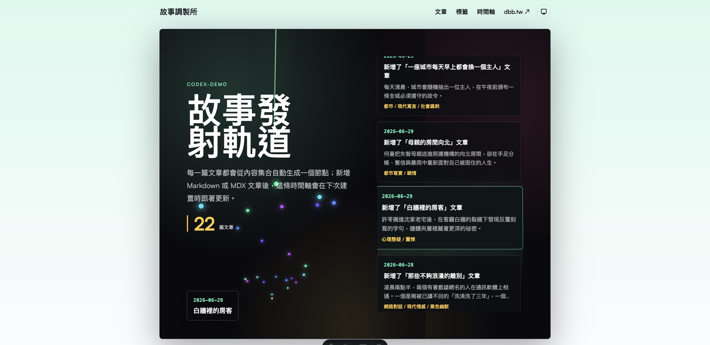
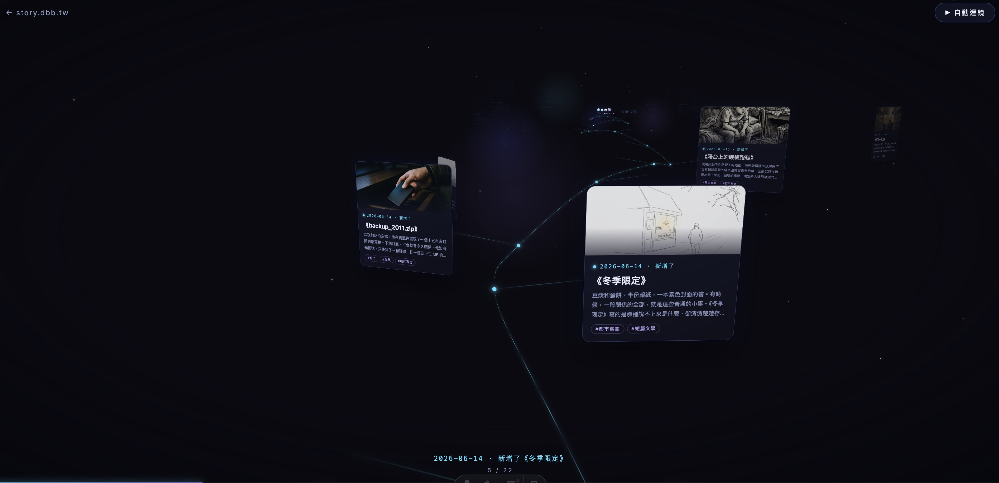

## Table of contents

## 前言：我只是想做一個很帥的時間線

前幾天，Fable 突然解禁了，於是想說要拿來做什麼酷東西，結果上網一看，別人的創意永遠比較酷，抄襲也沒什麼意思，所以就想說拿來解決自己的問題好了。我剛好有一個故事站，少了一個時間線的頁面，其實也不能說少了頁面，就是原本這個主題就沒有打算支援，但是網站有時間線看起來又很酷，所以想說來做一個吧。

## Codex 和 Fable 做出來的東西差在哪

然後突然心血來潮，順便開了 Codex 來做看看，比較一下兩個的風格。我 prompt 給的超級隨便： 

***幫我基於這個站點的內容 做一個時間線 越帥越好 我要 3d 的***

就真的只有這樣，然後等了幾分鐘之後，兩個模型就分別做出了頁面。

Codex 的頁面，從工程面來說，處理的蠻好的。從需求面來說，它確實做出了 3D，也符合站點樣式，但從美觀角度，真的醜到爆。

Fable 就不一樣了，畫面做的蠻美的。但是，就是這個但是，首先 bug 多到爆炸，然後完全沒配合全站的風格，自己獨立一頁，然後效能也是差到爆，還幫我裝了一些特效插件。

從結果來看，Fable 確實會多做很多我沒想到的東西。感覺做出驚喜的的機會比較高。但是就工程的角度，我目前還是覺得 Codex 比較棒，樣式、維護性什麼都處理的比較好。但這不是什麼模型的測試，只是我自己的興之所至而已，畢竟給了這種 prompt 就是要來抽獎而已，所以不要噴我測試的結果，有可能下次就結果反轉了，我也不確定。而且我也沒有無限的 token 來測試，所以這純粹是個人的使用心得。

## Fable 的第一印象：很強很燒 token

然後主管看我玩了好幾天後，突然就叫我整理一下心得分享給大家，於是乎我就簡單的整理一下，以下全部都是超級主觀的體驗，所以看看就好。

首先要講的是，我用 Fable 主要是拿來做 Nextjs 的專案，然後純粹用在這個專案的前端而已，我讓它自己打開瀏覽器去看 figma ，然後用截圖的方式去實作頁面直到做完為止，主要處理動畫以及排版位置，不處理太細的響應式寬度或工程細節。所以我要講的是，我的 Fable 體驗全部都是基於前端。

第一個印象就是，token 消耗超級兇，如果不好好盯著它看， prompt 給的太隨便，他真的一下子 Current session 就噴掉 10% 給你看。

## 它太容易把小事變成大事

我覺得問題在於，它很喜歡把小事情搞得很複雜，我有一個印象很深的情境，我請他添加一個 card 圓角，prompt 很單純：

***幫 landing page 的 ServiceCard 加上 10px 圓角。***

結果它幫我開了兩個 subagent 去看了全專案其他 card 有沒有圓角，另一個去看過去的 commit history ，檢查以前圓角的變化。這完全超出我的預期，只是添加一個圓角而已，結果幫我去考古了。

另一個印象就是真的超慢的，可以直接結合我剛剛的案例，添加一個圓角他也要花好幾分鐘搞清楚專案才做事，真的超沒效率。

抽象的總結的話，就是找一個太聰明的人做太簡單的事情，不一定是個好事，我專案快要結束前，我還刪掉了兩個設計稿根本不存在的區塊，它的註解是：「TODO：此處應有創辦人的話。」它還自己兼任了 UI 設計了。

## 我目前使用方式

所以我自己目前的工作流，只做前端的時候，大部分的排版我都是直接用 Sonnet 基本上又快又穩，然後動畫就是把影片丟給 Opus 去逐幀解析。這兩個都弄不好的細節，我才用 Fable 來處理。

## Fable 適合什麼任務

說是這樣說，我還是用 Fable 做了一個[翻書的 timeline](https://story.dbb.tw/timeline)，我真的覺得很漂亮。最強的是，前後我只調整三次，第一次自由發揮，第二次修 bug ，第三次結合全站風格，真的很強。我覺得這種需要綜合能力的地方，或是需要處理複雜邏輯的地方，可能才是 Fable 發光的舞台吧。

## 補充：把 Fable 拿來建立制度

最後補充一個，在網路上看到的酷東西，因為 Fable 目前只是給我們體驗一下而已，訂閱制應該只能用到 7/7 號，所以有人用一個很酷的 prompt 來試圖榨乾它：

這是我這輩子唯一一次使用 Fable 5 的機會。這個 session 結束後，我的環境將由後續可用的其他模型（Sonnet、Opus、Haiku 等）長期運作。所以你的任務只有一個：把你的判斷力轉成可長期沿用的制度與檔案，讓之後每一個由這些模型運作的 session 都因此變強。用這個 session 立制度，不要拿去執行日常任務。

說真的蠻佩服這個思路的，把這個算力拿來做成判斷標準，而不是用在一次性的工作上，我真的覺得超聰明的。

